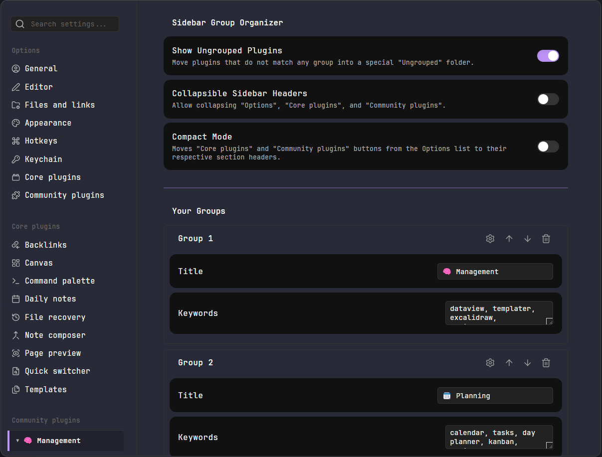

# 🗂️ Obsidian Settings Sidebar Organizer

**Tame your plugin list.** Group Community Plugins into custom collapsible folders, rename them (alias), reorder them manually, compact the sidebar UI headers, and more...

## 🗿 Why?

Created because I had too many plugins and got lost in the sidebar; feedback welcome!

> [!CAUTION]
> **Experimental "DOM Hack"**
> This plugin manipulates the Obsidian UI directly because there is no official API for the settings sidebar.
> * **Risk:** If Obsidian updates their UI structure (CSS classes), this plugin might break or stop working until updated.
> * **Stability:** It creates "proxy" buttons. When you click an item in a folder, it programmatically clicks the real, hidden button.

## ✨ Key Features

### 1. 📂 Grouping & Organization
* **Custom Folders:** Create your own categories (e.g., "Design", "Automation").
* **Keyword Matching:** Automatically sorts plugins into folders based on words in their names.
* **"Ungrouped" Folder:** Automatically catches any plugin that doesn't match your keywords so nothing gets lost (can be hidden).

### 2. ✏️ Aliases & Order
* **Renaming (Aliasing):** Rename plugins in the sidebar to save space or improve clarity.
* **Manual Reordering:** Use Up/Down arrows to sort plugins inside their folders exactly how you want them.

### 3. 📉 Compact & Clean UI
* **Compact Mode:** Hides the large "Core plugins" and "Community plugins" tabs. It moves them to small ⚙️ icons in the section headers to improve clarity.
* **Collapsible Headers:** Allows you to fold the main "Options", "Core plugins", and "Community plugins" sections.

## 📦 Installation

### Method 1: Manual (recommended)
1. Download `main.js` and `manifest.json`.
2. Create folder `.obsidian/plugins/settings-sidebar-organizer/`.
3. Paste files and reload Obsidian.

### Method 2: BRAT
1. Install **BRAT** from the Community Plugins store.
2. Go to **Settings > BRAT > Add Beta plugin**.
3. Paste this repo URL: `https://github.com/CyrylSz/obsidian-settings-sidebar-organizer`
4. Click **Add Plugin**.

## ⚙️ How to use
Everything is configured via **Settings > Settings Sidebar Organizer**:

1.  **Create Group:** Click `+ Add Group`.
2.  **Assign Plugins:** Type keywords (comma-separated) in the "Keywords" box.
3.  **Fine-tune:** Click the **Gear Icon (⚙️)** next to a group to:
    * Set an **Alias** (rename).
    * **Reorder** items.
